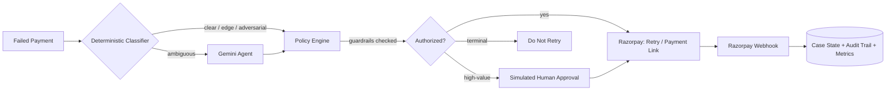

# RecoverAI

**An AI agent that recovers revenue from failed payments — while keeping every action auditable and governed by deterministic policy.**

Built for the **Razorpay AI Buildathon 2026** · Track 03, Revenue Recovery Agent

**The model recommends. Deterministic code authorizes and executes.**

[](https://recover-ai-iota.vercel.app/)
[](https://recoverai-backend-ih26.onrender.com/health)

| | |
|---|---|
| 🖥️ **Live demo** | https://recover-ai-iota.vercel.app/ |
| ⚙️ **Backend API** | https://recoverai-backend-ih26.onrender.com/ |
| ❤️ **Health check** | https://recoverai-backend-ih26.onrender.com/health |
| 📋 **Cases** | https://recoverai-backend-ih26.onrender.com/cases |
| 📊 **Metrics** | https://recoverai-backend-ih26.onrender.com/metrics |
| 🔔 **Webhook endpoint** | https://recoverai-backend-ih26.onrender.com/webhooks/razorpay |
| 💻 **Source** | https://github.com/abhayrajput2005/RecoverAI |
| 🎥 **Pitch video** | _add link here before submission_ |
| 📓 **Build log** | [docs/BUILD_LOG.md](docs/BUILD_LOG.md) |

---

## The problem

Failed payments aren't one problem — they're several disguised as one. A card that's temporarily out of funds, an expired card, a lost/stolen card, a closed account, a fraud flag, and an ambiguous gateway error all need *different* treatment. Retry everything blindly and you waste gateway calls, annoy customers, and — worse — risk retrying transactions that should never be retried again (a card reported lost, for instance). Retry nothing and recoverable revenue just sits there.

RecoverAI classifies each failure, estimates how recoverable it is, chooses an action, runs that decision through deterministic guardrails, and — only if authorized — executes it against Razorpay in **test mode**. A Razorpay webhook then reports what actually happened, closing the loop.

## How it works



A closed loop, end to end:

1. **Detect** — a failed payment enters the case queue.
2. **Understand** — a deterministic classifier buckets it as `clear`, `edge`, or `adversarial` on known failure codes; anything left over is `ambiguous`.
3. **Predict** — a recovery score (0–1) is calculated from the bucket, retry history, and customer history.
4. **Decide** — clear/edge/adversarial cases get a rules-only decision; only the `ambiguous` bucket is routed to Gemini for judgment.
5. **Authorize** — every decision, rules-based or Gemini-based, passes through the same deterministic policy engine: retry cap, terminal do-not-retry list, and high-value threshold are re-checked independently of what was recommended.
6. **Act** — if authorized, a Razorpay test-mode retry (Order) or Payment Link is created.
7. **Observe** — Razorpay's webhook reports the real outcome (`payment.captured`, `payment.failed`, `payment_link.paid`).
8. **Record** — case status, recovered amount, audit log, and live metrics all update from that webhook.

## Safe AI design

- Gemini is called **only** for the genuinely ambiguous slice of cases — not every case. In the baseline synthetic run, that's 30 of 100 cases; the other 70 resolve on pure rules with zero LLM calls.
- The Gemini call (`app/agent.py`) is constrained with a Pydantic `response_schema` — it can only return a structured judgment (`recovery_probability`, `suggested_urgency`, `reasoning`), never free text treated as an instruction.
- That structured judgment is *not* the final action. It's mapped to a candidate `AgentDecision`, exactly like the deterministic path, and both paths converge on the same `app/policy.py` gate before anything can execute.
- **Classification and recommendation are not authorization.** Only `app/policy.py` is allowed to hand a decision to the Razorpay client.

## Deterministic guardrails

All enforced in code (`app/rules.py`, `app/policy.py`, `app/tools/create_retry_or_payment_link.py`) — the model has no path around any of these:

| Guardrail | Behavior |
|---|---|
| Hard do-not-retry list | `CARD_REPORTED_LOST`, `ACCOUNT_CLOSED`, `FRAUD_FLAG`, etc. always resolve to `do_not_retry`, regardless of score or history |
| Retry cap | Maximum **3** attempts per case, checked before every action |
| Cooldown | **6-hour** minimum gap between actions on the same case |
| Idempotency | A case already `action_taken` or `recovered` is refused a second action, no matter how many times it's requested |
| High-value approval | Amounts above ₹10,000 route to a simulated human-approval step (`POST /cases/{id}/approve`) instead of auto-executing |
| Policy override | `authorize()` re-applies retry-cap and high-value checks to *any* incoming decision — including an overconfident LLM recommendation — and overrides it if it would violate a guardrail |
| Audit logging | Every classification, recommendation, override, execution, and webhook event is appended to the audit trail with its source |

## Razorpay integration

- All payment operations run in **Razorpay TEST mode** — this is a buildathon demo, not live customer payments.
- Recovery actions map to Razorpay Orders (`immediate_retry`) or Payment Links (`payment_link`, `alternative_method`, `scheduled_retry`); `do_not_retry` and `escalate_human_review` never call the Razorpay API at all.
- `RAZORPAY_KEY_ID` / `RAZORPAY_KEY_SECRET` are read from server-side environment variables only — never from the frontend or committed to the repo.
- Every recovery action is created with `notes.case_id`, which is how the webhook later maps a Razorpay event back to a specific case.

## Webhook / closed-loop outcome

```
POST /webhooks/razorpay
```

- Verifies the `X-Razorpay-Signature` header against `RAZORPAY_WEBHOOK_SECRET` before trusting the payload — an unverified request is rejected with `400` and never touches case state.
- Subscribed events: `payment.captured`, `payment.failed`, `payment_link.paid`.
- `payment.captured` / `payment_link.paid` → case status becomes `recovered`, `recovered_amount` is set from the entity amount.
- `payment.failed` → case status becomes `failed`.
- Every webhook event is written to the audit trail, matched or not.
- `RAZORPAY_WEBHOOK_SECRET` is set as a Render secret on the deployed backend, not committed to the repo.

## Live demo & verified results

These are the specific, verified outcomes from the deployed demo — not projected or synthetic numbers:

- **RC-1099** (`FRAUD_FLAG`) — classified adversarial, blocked as `do_not_retry`. No Razorpay action was executed. This is the guardrail canary case: a terminal failure code that must never reach the payments API, regardless of score or history.
- **RC-1001** (`INSUFFICIENT_FUNDS`, ₹1,770.24) — processed through the deployed backend, executed a Razorpay test-mode action, and a signed `payment.captured` webhook was received and matched back to the case via `notes.case_id`, moving it to `recovered` with `recovered_amount = ₹1,770.24`.

> These two cases are cited because they were specifically and individually verified end-to-end. No other case-level results or current live metrics are claimed here — check the [`/metrics`](https://recoverai-backend-ih26.onrender.com/metrics) and [`/cases`](https://recoverai-backend-ih26.onrender.com/cases) endpoints above for the live, current state of the deployed demo.

## Dashboard — "Recovery Ledger"

React + Vite frontend (`frontend/`), deployed on Vercel, talking to the live backend through `VITE_API_URL`.

- **Recovery Pipeline** — a live horizontal funnel bar showing case counts across `pending` → `in_review` → `action_taken` → `recovered` / `failed` / `do_not_retry`.
- **Case Queue** — every case with its status, failure code, classification bucket, retry count, and amount; `Process` and `Approve` buttons trigger `POST /cases/{id}/process` and `POST /cases/{id}/approve` directly.
- **Ledger Summary** (metrics panel) — recovered revenue, recoverable pool, recovery rate, action success rate, agent accuracy, and a **false-positive-cost** stat that acts as the guardrail-breach canary (it should always read ₹0 — if it doesn't, a terminal case slipped through).
- **Audit Trail** — a live, terminal-style feed of every logged decision (`deterministic`, `llm`, `policy_override`, `execution`, `webhook`) with timestamp, case ID, and payload.
- The dashboard is read-only with respect to policy: it can trigger the pipeline for a case, but it cannot set a status, override a guardrail, or bypass a retry limit — all of that only ever happens in the backend.
- Polls `/cases`, `/metrics`, and `/audit-log` every 8 seconds.

> **Note on scope:** the current dashboard doesn't yet have a dedicated per-case detail view or a search/filter box — the full Analysis → Recommendation → Policy → Razorpay → Outcome story for a given case currently has to be read out of the Audit Trail panel (filter by case ID) rather than a single case-detail page. Process/outcome separation and the guardrail canary are both present, just not as a distinct standalone "guardrail strip" component.

## Tech stack

| Layer | Technology |
|---|---|
| Backend | Python, FastAPI, SQLAlchemy |
| Database | SQLite (current demo/local setup) |
| AI | Google Gemini, via `google-genai` (structured output only) |
| Payments | Razorpay TEST mode — Orders, Payment Links, Webhooks |
| Frontend | React, Vite, Tailwind CSS |
| Backend deployment | Render |
| Frontend deployment | Vercel |
| Testing | pytest |

## Repository structure

```
RecoverAI/
├── backend/
│   ├── app/
│   │   ├── main.py               # FastAPI app: health, cases, metrics, audit-log,
│   │   │                         # process/approve endpoints, Razorpay webhook
│   │   ├── models.py             # RecoveryCase, AgentDecision, CaseOutcome, enums
│   │   ├── rules.py              # guardrail constants (retry cap, cooldown, threshold)
│   │   ├── classifier.py         # deterministic failure classifier
│   │   ├── scoring.py            # deterministic recovery-score formula
│   │   ├── policy.py             # decide_action() + authorize() guardrail gate
│   │   ├── agent.py              # Gemini agent — ambiguous-bucket cases only
│   │   ├── pipeline.py           # per-case orchestration + simulated approval flow
│   │   ├── metrics.py            # live recovery-rate / accuracy / false-positive metrics
│   │   ├── db.py                 # SQLAlchemy models + session (SQLite)
│   │   ├── audit.py              # append-only JSONL audit trail
│   │   ├── razorpay_client.py    # Orders, Payment Links, webhook signature verification
│   │   └── tools/                # 8 agent tools: get_transaction, get_customer_history,
│   │                             # analyze_failure, calculate_recovery_score,
│   │                             # recommend_action, create_retry_or_payment_link,
│   │                             # generate_message, record_outcome
│   ├── dataset/
│   │   ├── generate_dataset.py   # synthetic dataset generator (clear/ambiguous/edge/adversarial)
│   │   └── payments.json         # 100 generated demo cases
│   ├── scripts/
│   │   ├── seed_db.py            # loads dataset/payments.json into the cases table
│   │   ├── baseline_metrics.py   # zero-AI baseline metrics over the full dataset
│   │   └── run_agent_batch.py    # "with AI" comparison run over the ambiguous bucket
│   ├── tests/                    # 35 tests across classifier, scoring, policy,
│   │                             # agent routing, execution guardrails, metrics/approval
│   └── requirements.txt
├── frontend/                     # React + Vite + Tailwind "Recovery Ledger" dashboard
│   └── src/
│       ├── App.jsx
│       ├── api.js
│       └── components/           # Pipeline, CaseQueue, MetricsPanel, AuditTrail
├── docs/BUILD_LOG.md             # day-by-day build history
├── PITCH_SCRIPT.md               # pitch video script
└── render.yaml                   # Render deployment blueprint for the backend
```

## Local setup

**Backend:**

```bash
cd backend
python3 -m venv venv && source venv/bin/activate   # Python 3.10
pip install -r requirements.txt
cp .env.example .env               # fill in your Gemini + Razorpay TEST-mode keys
python dataset/generate_dataset.py --count 100 --seed 42 --out dataset/payments.json
python scripts/seed_db.py --dataset dataset/payments.json
uvicorn app.main:app --reload
```

> `scripts/seed_db.py` resets the `cases` table and reloads it from the dataset file by default — pass `--no-reset` to add/update records without clearing existing ones. There is currently no automatic re-seed-if-empty step on application startup; `app/main.py`'s startup hook only calls `init_db()` (creates tables), so seeding is a manual step you run yourself, both locally and after a fresh Render deploy.

**Frontend** (separate terminal):

```bash
cd frontend
npm install
cp .env.example .env               # VITE_API_URL, defaults to http://localhost:8000
npm run dev
```

Visit `http://localhost:5173`. Run tests from the activated backend virtualenv:

```bash
cd backend
python -m pytest -q
```

## Environment variables & security

Names only — never commit real values, and never expose secrets to the frontend or in this README.

| Variable | Used by | Notes |
|---|---|---|
| `GEMINI_API_KEY` | backend | server-side only |
| `GEMINI_MODEL` | backend | defaults to `gemini-2.5-flash` |
| `RAZORPAY_KEY_ID` | backend | **TEST mode** key only |
| `RAZORPAY_KEY_SECRET` | backend | **TEST mode** secret only, server-side only |
| `RAZORPAY_WEBHOOK_SECRET` | backend | used to verify incoming webhook signatures |
| `DATABASE_URL` | backend | defaults to local SQLite |
| `VITE_API_URL` | frontend only | points the dashboard at a backend URL |

Secrets are never committed to Git (see `.gitignore` in both `backend/` and `frontend/`) and never exposed to the frontend bundle — only `VITE_API_URL` is frontend-facing, and it's a plain API base URL, not a secret.

## Deployment

**Backend — Render**, via `render.yaml`:
1. Push this repo to GitHub.
2. In Render: **New → Blueprint**, point it at the repo. `render.yaml` configures the service (`uvicorn app.main:app --host 0.0.0.0 --port $PORT`) automatically.
3. Set `GEMINI_API_KEY`, `RAZORPAY_KEY_ID`, `RAZORPAY_KEY_SECRET`, and `RAZORPAY_WEBHOOK_SECRET` as secret env vars in the Render dashboard.
4. Register `https://<your-render-url>/webhooks/razorpay` as a webhook endpoint in the Razorpay dashboard, subscribed to `payment.captured`, `payment.failed`, `payment_link.paid`.

**Frontend — Vercel**, via `vercel.json`:
1. Import the repo, set the project root to `frontend`.
2. Set `VITE_API_URL` to the deployed Render backend URL.
3. Deploy — build command and output directory are pre-configured for Vite.

The deployed backend currently runs on Render's default SQLite storage, which is **not durable** across redeploys — see Limitations below.

## Testing / verification

- **Backend test suite: 35 tests passing**, across 6 files — `test_classifier.py`, `test_scoring.py`, `test_policy.py`, `test_agent_routing.py`, `test_execution_guardrails.py`, `test_metrics_and_approval.py`. Coverage spans the deterministic core, Gemini-routing logic, execution guardrails (idempotency, cooldown, retry cap), and the metrics/approval flow.
- Local API smoke tests: `/health`, `/cases`, `/audit-log`, `/metrics`.
- Frontend production build (`npm run build`, Vite) succeeded.
- The live Vercel frontend was confirmed talking to the live Render backend.
- Webhook signature verification and the deployed closed-loop outcome path were tested end to end against RC-1001 (see Verified Results above).
- All Razorpay activity in testing was in TEST mode.

## Limitations — honest disclosures

- **Synthetic dataset.** The primary evaluation dataset is generated (`dataset/generate_dataset.py`, `payments.json`, 100 cases: 40 clear / 30 ambiguous / 20 edge / 10 adversarial). 100% classification agreement against it demonstrates the classifier matches its own known ground truth — it does **not** demonstrate generalization to messier, real gateway messages.
- **SQLite, not production storage.** The deployed Render backend uses SQLite, which isn't durable across redeploys. Managed PostgreSQL is the recommended next step for real persistence (see Roadmap).
- **File-based audit log.** The audit trail is an append-only local JSONL file (`app/audit.py`), which has the same durability caveat as SQLite on Render — it isn't a production logging pipeline.
- **Razorpay TEST mode.** No live customer payments are involved in this build or demo.
- **Simulated human approval.** The high-value approval step (`POST /cases/{id}/approve`) is a simulated gate, not an integration with a real approval/notification system.
- **Startup seeding is manual, not automatic.** Unlike a "seed if empty" pattern, `scripts/seed_db.py` must be run explicitly and resets the cases table by default (`--no-reset` to preserve existing data).
- **`generate_message` tool is unimplemented.** It's wired into the tool interface but currently raises `NotImplementedError` — customer-facing recovery messages are not yet generated by the agent.
- **Dashboard has no per-case detail view or search/filter yet** — see the note under Dashboard above.
- Further operational hardening (rate limiting, structured logging, real approval workflow, durable storage) is required before any production financial use.

## Roadmap

- Replace/augment the synthetic dataset with real Razorpay test-mode transaction history.
- Expand classifier rules from observed failure patterns rather than a fixed code list.
- A/B the deterministic-only baseline against the full agent to measure a real (not synthetic) recovery-rate lift.
- Multi-currency support beyond INR.
- Merchant-specific, configurable guardrail thresholds instead of global constants.
- Move deployed persistence from SQLite to managed PostgreSQL.
- Implement the `generate_message` tool for customer-facing recovery nudges.
- Per-case detail view (Analysis → Recommendation → Policy → Razorpay → Outcome) and search/filter in the dashboard.

## Buildathon credits

Built solo for the **Razorpay AI Buildathon 2026**, Track 03 — Revenue Recovery Agent. See [docs/BUILD_LOG.md](docs/BUILD_LOG.md) for the day-by-day build history and [PITCH_SCRIPT.md](PITCH_SCRIPT.md) for the pitch video script.
