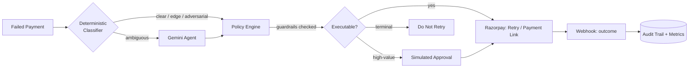

# RecoverAI

**An AI agent that recovers revenue from failed payments — without ever taking an action a human couldn't audit and undo.**

Built for the Razorpay AI Buildathon 2026, Track 03 (Revenue Recovery Agent).

[Live demo](#) · [Pitch video](#) · [Build log](docs/BUILD_LOG.md)

---

## The problem

Failed payments aren't all the same. A card that expired mid-subscription is
a completely different problem from a card reported lost — but most retry
logic treats them identically, either retrying everything blindly (annoying
customers, wasting gateway calls, sometimes retrying transactions that
should never be retried) or retrying nothing (leaving recoverable revenue on
the table). RecoverAI reads each failed payment, classifies *why* it failed,
decides the right next action, and executes it through Razorpay — while a
deterministic policy layer makes sure the AI can never override the rules
that actually matter: retry caps, cooldowns, high-value approval, and a
hard do-not-retry list for terminal cases.

## How it works



The system is a closed loop: **Detect** (failed payment lands in the queue)
-> **Understand** (classify the failure) -> **Predict** (recovery
probability) -> **Decide** (pick an action) -> **Act** (execute via
Razorpay) -> **Learn** (webhook records the real outcome, feeding the
metrics that prove whether any of this actually worked).

### The one design decision that matters most

**The model recommends. Deterministic code authorizes and executes.**
Gemini is only ever consulted for the genuinely ambiguous ~30% of cases —
vague gateway messages with no clear precedent. Every other case (roughly
70% of failures in testing) is resolved by pure rules, with zero AI
involved and zero API cost. And *every* decision, whether it came from the
rules or from Gemini, is re-checked by the same policy engine before
anything executes: retry cap hit -> blocked. Terminal failure code
(lost/stolen card, closed account, fraud flag) -> blocked, no exceptions.
Amount above the configurable threshold -> held for simulated approval. This
means a confidently wrong LLM judgment literally cannot cause a bad
financial action — the guardrail tests in `backend/tests/` deliberately
mock an "overconfident" LLM recommendation and confirm the policy engine
overrides it.

## Results

Baseline run (zero AI, deterministic core only, n=100 synthetic cases):

| Metric | Result |
|---|---|
| Classification agreement with ground truth | 100% (100/100) |
| Guardrail failures (adversarial case not blocked) | 0 |
| Cases resolved without any LLM call | 70/100 |

Run `python scripts/baseline_metrics.py` to reproduce, and
`python scripts/run_agent_batch.py` (with a `GEMINI_API_KEY` set) to get
the full "with AI" numbers on the ambiguous bucket — this is the
comparison that shows what the agent layer actually adds over rules alone.

## What makes this hard (and how it's handled)

| Risk | Mitigation |
|---|---|
| LLM hallucinates a plausible-sounding but wrong action | Structured output only (`response_schema`), never free text taken as an executable action |
| Model recommends retrying something that shouldn't be retried | Deterministic do-not-retry list checked independently of the model, on every path |
| Duplicate recovery actions on the same case | Idempotency check against case status before any Razorpay call |
| Retrying too aggressively | Hard retry cap + cooldown window enforced in code, not by the model |
| High-value transaction acted on without oversight | Configurable rupee threshold routes to a simulated human-approval step |
| No way to know if any of this is actually working | Full audit trail (every decision logged with its source) + live recovery-rate/accuracy/false-positive-cost metrics |

## Tech stack

- **Backend**: Python, FastAPI, SQLAlchemy (SQLite for dev)
- **AI agent**: Google Gemini (`google-genai`, structured output only)
- **Payments**: Razorpay test mode — Orders, Payment Links, Webhooks
- **Frontend**: React, Vite, Tailwind
- **Deployment**: Render (backend), Vercel (frontend)

## Project structure

```
RecoverAI/
├── backend/
│   ├── app/
│   │   ├── main.py          # FastAPI entrypoint + webhook + endpoints
│   │   ├── models.py        # RecoveryCase, AgentDecision, CaseOutcome, etc.
│   │   ├── rules.py         # guardrail constants
│   │   ├── classifier.py    # deterministic failure classifier
│   │   ├── scoring.py       # deterministic recovery-score formula
│   │   ├── policy.py        # decision + guardrail authorization
│   │   ├── agent.py         # Gemini agent (ambiguous cases only)
│   │   ├── pipeline.py      # per-case orchestration + approval flow
│   │   ├── metrics.py       # live recovery-rate / accuracy metrics
│   │   ├── db.py            # SQLite persistence
│   │   ├── audit.py         # decision audit trail
│   │   ├── razorpay_client.py
│   │   └── tools/           # the 8 agent tools
│   ├── dataset/generate_dataset.py
│   ├── scripts/              # seed_db, baseline_metrics, run_agent_batch
│   ├── tests/                 # 28 tests across the deterministic core,
│   │                           # LLM routing, execution guardrails, and metrics
│   └── requirements.txt
├── frontend/                  # React + Vite + Tailwind "Recovery Ledger" dashboard
└── render.yaml
```

## Running it locally

```bash
# Backend
cd backend
python3 -m venv venv && source venv/bin/activate
pip install -r requirements.txt
cp .env.example .env   # add your Gemini + Razorpay test-mode keys
python dataset/generate_dataset.py --count 100 --seed 42 --out dataset/payments.json
python scripts/seed_db.py --dataset dataset/payments.json
uvicorn app.main:app --reload

# Frontend (separate terminal)
cd frontend
npm install
cp .env.example .env
npm run dev
```

Full setup, deployment, and testing instructions: [docs/BUILD_LOG.md](docs/BUILD_LOG.md).

## Roadmap

- Replace the synthetic dataset with real (test-mode) Razorpay transaction history
- Extend the classifier's rule set as new failure_code patterns are observed in production
- A/B the deterministic-only baseline against the full agent in a live environment to get a real (not synthetic) recovery-rate lift number
- Multi-currency support beyond INR
- Configurable guardrail thresholds per merchant, rather than global constants

## What I'd do differently

The synthetic dataset is the honest limitation of this build: it's
internally consistent (which is why the deterministic core hits 100%
agreement against it) but it can't tell you how well the *classification
rules themselves* generalize to real, messier gateway messages. The next
real test is running this against actual Razorpay test-mode failure logs
and seeing where the rule set breaks.
